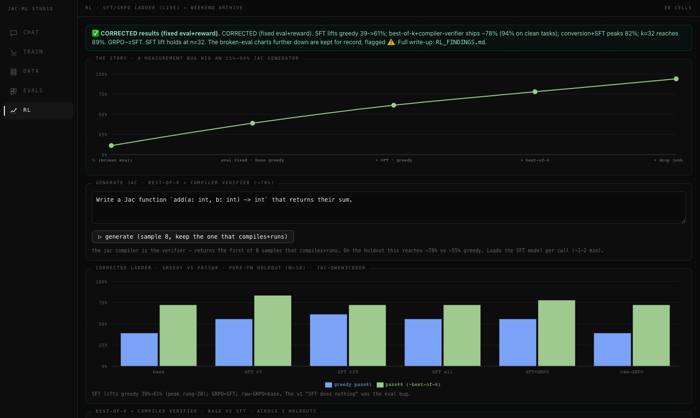

# Jac Model Studio: giving a fine-tuning lab an actual cockpit

Fine-tuning a language model on your own hardware is mostly not fine-tuning. It's plumbing.

You have a corpus somewhere, a script that turns it into JSONL, another that starts a LoRA run, and a third that scores the adapter against a holdout set. A folder fills with adapters named `qwen3-sft-r16-lr2e5-v3` that you won't be able to decode in four days. Eleven terminal tabs, three of which are the same `tail -f`.

Jac Model Studio (JMS) is the attempt to put all of that behind one window. It's a desktop app for running and managing local model fine-tuning: continued pre-training (CPT), supervised fine-tuning (SFT), preference optimization (DPO), and evaluation.

## One language, both sides of the wire

JMS is written entirely in [Jac](https://www.jac-lang.org/), which supersets Python and adds object-spatial programming: your data lives on a persistent graph of nodes and edges and you write walkers that traverse it, instead of writing queries against a database you provisioned separately. Jac also compiles to a React client, so the same language writes the server endpoints and the UI.

For JMS that means 34 server modules (`.sv.jac`) and 65 client components (`.cl.jac`), around 26,000 lines, in one codebase with no API layer to keep in sync. There's no ORM and no migrations folder. Chats, eval runs, projects, and workspaces are graph nodes hanging off a per-user root, and they persist because that's what the graph does.

Here is the entire create-a-workspace endpoint, from `jms/jms_workspaces.sv.jac:125`:

```jac
"""Add a new JMS workspace, sorted after every existing one. Returns the
refreshed layout dict (same shape as `jms_ui_layout`)."""
def create_jms_workspace(label: str, accent: str) -> dict {
    _seed_jms_workspaces();
    wid = _next_jms_workspace_id();
    acc = accent if accent else _next_jms_accent();
    root ++> JmsWorkspace(
        wid=wid, label=label, accent=acc, sort_order=len(_all_jms_workspaces())
    );
    return jms_ui_layout();
}
```

`root ++> JmsWorkspace(...)` is the write; the matching read further up the file is `[root -->][?:JmsWorkspace]`. Both `root`s are the calling user's own root, so nothing in this file knows what a `user_id` column is and there is no `WHERE owner = ?` to forget. The client side is one import and one call. `JmsWorkspaceSettings.cl.jac:27` says `sv import from ..jms_workspaces { create_jms_workspace, ... }`, and line 121 says `ly = await create_jms_workspace(newLabel.strip(), newAccent);`. No fetch wrapper, no route string, no response type declared twice.

The app before this one was FastAPI plus Next.js, and it was deleted. This one runs as a native desktop webview with the API in-process, so there's no browser tab to lose track of.

## Two surfaces, one router

JMS has two faces. Experiments is the research lab: four workspaces, one per research phase (SFT/DPO, RL/GRPO, CPT, CPT-SFT), each with a left rail of sections for CHAT, DATA, TRAIN, EVALS, CLOUD, and PLAN. Switch workspace and the whole toolset re-points at that experiment's corpus, runs, and results. This is where the messy exploratory work lives.

The JMS surface is the product pipeline: a five-stage rail per project, SOURCES → GENERATE → CURATE → TRAIN → EVAL·CHAT. Point it at documents, generate training rows, hand-curate them, carve a train/holdout split, train, score. Same machinery, arranged for someone who wants to fine-tune a model rather than study fine-tuning.

Underneath both sits `jobs.sv.jac`, the job engine. Training runs are detached subprocesses rather than threads, with state written to disk as the source of truth, so a run survives a server restart and the app reattaches on boot. A global heavy-job lock guards the GPU, because the machine this was built for has one of them and 48 GB of unified memory. It's a lock file plus a sibling guard file, so a crashed process can't deadlock the slot.

Rented cloud GPUs are wired in too, over the Spheron REST API, with spend guardrails on concurrency, daily budget, and hourly rate.

## Eleven themes, then one



The design history is the part I'd most want to warn a past version of myself about. At one point the app carried eleven themes and seven layouts, both switchable at runtime. It felt like flexibility. It was a tax: every new component had to look right in eleven palettes, and every layout variant was a second rendering of the same shell that could quietly drift from the first. On 19 July 2026 the whole thing got stripped in a single commit. Six alternate layout renderings gone, ten alternate palettes gone, both switchers deleted, 839 lines removed against 39 added.

Three days later the rebuild started from one file. On 22 July, `theme.css` was rewritten as the single canonical token source, light and dark, with one orange accent (`#EC8242` light, `#f4914e` dark). A dormant five-swatch theme switcher still sitting in the JMS surface got deleted on the 23rd, along with its `data-jms-theme` attributes and CSS. Its commit message reads, a little wearily, "No visual change, the machinery was already dormant."

The mesh-gradient frosted-glass look survived about five days. On 28 July it was flattened. Here is the top of the light palette as it stands, `jms/theme.css:12`:

```css
:root {
  /* ===== FLAT palette — LIGHT (default) =====
     Flat white, no mesh gradient, no tint. Orange is the ONLY chromatic element:
     buttons, highlights, focus, active states. Panels separate from the page by a
     hairline border + a soft shadow, not by a fill difference. */
  --bg: #ffffff;
  --bg-gradient: none;
  --surface: #ffffff;
  --surface-strong: #ffffff;
  --bar: #ffffff;
  --overlay: #ffffff;
  --text: #0a0a0a;
  --text-muted: #6e6e6e;
  /* neutral hairlines — --border is the panel rim, --border-alt the divider */
  --border: rgba(0,0,0,0.12);
  --border-alt: rgba(0,0,0,0.10);
  --accent: #EC8242;
```

Five identical `#ffffff` values in a row is the whole edit. Page, panel, raised panel, top bar, and overlay were five different translucent tints under the glass theme; now they are the same white, and a panel is legible only because of `--border` and a soft shadow. The dark half is `#000000` page against `#0e0e0e` surface. `--blur` is still defined a few lines down, with a comment admitting it is now a no-op on panels and survives only for the overlay scrims. Orange had to be paired with a dark-brown foreground instead of white, because white on `#EC8242` measures 2.6:1 and fails AA contrast. Eleven themes down to one, and the one is better than any of the eleven were.

## Workspaces and a grounded assistant

Workspaces group projects. The Experiments side seeds one per research phase and treats them as fixed; the JMS side lets you make your own, using the endpoint above.

The assistant is the feature I'm least tired of. `assistant.sv.jac` is the second-largest server module in the app, and most of its size isn't the chat loop, it's the grounding. Before answering anything it assembles a context bundle from live app state: workspaces, projects, runs, evals, chats, and a cloud digest. Ask it why your last eval failed and it's reading your actual eval nodes.

It talks to local MLX models, Claude, and OpenAI through one picker, with per-user API keys encrypted at rest that no endpoint ever echoes back. Responses stream over SSE, render as markdown with GFM tables, and can carry agentic actions: navigate to a section, start a training run, launch an eval. A local Gemma 3 4B at 4-bit fills the offline slot and cold-loads in about three seconds, so the assistant still works with no key configured and no network.

## Then we tried to break it

On 4 August 2026 the app went through a live verification sweep: roughly 20 scripted Playwright sessions driving the running dev server, not a test suite mocking it. Cold contexts with empty `localStorage`, full console and `pageerror` capture, computed-style probes, `elementFromPoint` hit-testing, `document.getAnimations()` sampling every frame, CDP screencast pixel capture, and real `page.mouse` clicks instead of `element.click()` wherever the question was whether a control could be clicked at all.

Scope: 48 experiment screens (4 workspaces by 6 tabs by 2 themes), a project's five pipeline stages in both themes, six overlays dismissed four ways each, four destructive-confirm sites armed and disarmed three ways each, eight cold starts, and a 234-action endurance run per theme.

Results, from the working notes in `jms/fixes.md`, which is a live document, still uncommitted, and not a published spec:

- Zero console errors, zero uncaught page errors, zero HTTP 4xx or 5xx across the whole sweep. The only non-2xx responses were two provoked on purpose.
- Cold start to interactive across 8 fresh contexts: 336 to 347 ms, with no 401 race.
- A black-flash-on-tab-switch bug got the hardest testing. Across 224 navigation clicks with no settle time, the minimum opacity of any wide element never left 1.0 and zero keyframe animations fired. Pixel capture of 322 real frames agreed: the frames that tripped a naive brightness threshold were sparse dark screens, fully rendered, not blank panes.
- Focus traps held on five overlays across 24 to 98 tab presses each, with zero escapes.
- 11 of 13 tracked fixes fully verified.

The sweep also found things, which is the point. Two destructive confirms were never wired to the shared auto-disarm hook, including the irreversible cloud VM terminate, the highest-consequence action in the app and the only one that could sit armed indefinitely. One button is disabled with no stated reason at all. One modal's trigger still sits under its own scrim.

Just as useful is the list of what deliberately wasn't tested. No real model load happened, so the file-descriptor recovery and lock-release paths are unproven end to end. Every Claude-dependent path is verified only in its refusal state. No cloud VM was provisioned. Writing those down as scheduled work beats letting them quietly count as passing.

## Where this goes

Everything above exists today. What follows does not.

Cloud dispatch should be a normal way to start a run rather than a separate mode. The pieces are in the repo already: Spheron deploy, a cloud-init bridge that bakes a training command into an instance's `runcmd`, a supervisor that pulls artifacts back and terminates the VM. What's missing is confidence, because none of it has run against a provisioned instance. The version I want doesn't ask *where* when you hit train. You pick a config, JMS weighs the job against the local GPU's queue and the price of an H100-hour, and streams the logs into the same panel a local run would use.

Then there's the backend problem, which is four lines long. From `jms/metrics.sv.jac:87`:

```jac
"""Dispatch to a named train-log parser (mlx is the only wired parser today)."""
def parse_train_log_by(parser: str, path: Path) -> dict {
    if parser == "mlx" { return parse_train_log(path); }
    return parse_train_log(path);
}
```

Both branches go to the same place. The `parser` argument is decoration on a function that has exactly one implementation, and the docstring says so. JMS grew up on Apple Silicon, and every loss curve it draws is scraped from an `mlx_lm` trainer log. A run on a rented A100 with PyTorch and DeepSpeed produces a different log shape entirely, and JMS would show you an empty chart. The near fix is a real parser registry behind that signature. The ambitious version is a normalized metric stream that MLX, PyTorch, Axolotl, and Unsloth runs all land in, so runs from different backends can sit on the same axes.

The section registry has the same shape of problem, and its own docstring is more optimistic than its body. `jms/components/SectionMount.cl.jac` opens on line 1 with:

```jac
"""Dynamic section registry — maps component names to mounted section bodies.

New section types register here once; AppShell imports SectionMount instead of
hard-coding a component→import map in the shell.
"""
```

Nothing registers anything. Twenty lines below that, starting at line 24:

```jac
    if component == "Chat" {
        return <Chat workspace={workspace} defaultModel={defaultModel} />;
    }
    if component == "Data" { return <Data />; }
    if component == "RlData" { return <RlData />; }
    if component == "CptData" { return <CptData />; }
    if component == "CptSftData" { return <CptSftData />; }
    if component == "CptSftPlan" { return <CptSftPlan />; }
    if component == "Train" { return <Train active={active} />; }
```

Six more branches follow. Each string in that chain has to match an entry in the thirteen-item `SECTION_TYPES` glob at `jms/workspace.sv.jac:596`, which is what the workspace editor lists. Adding a section means editing both, and the failure mode when you edit one is a panel reading `UNKNOWN SECTION`. That's fine at thirteen and miserable at fifty. What the docstring describes is what should happen: a component declares its own section type, and the workspace editor picks it up because it's on disk. Further out, that same seam is how someone else's eval harness gets mounted in your workspace without a pull request against this file.

Multi-user is the last piece, and it's half-built already. Identity and artifacts are multi-tenant today, with graph data on per-user roots and run directories namespaced per user. But the app runs in local single-user mode day to day, the workspace data-config is one TOML for the whole install, and the heavy-GPU lock is global across users on purpose. A real shared instance needs per-user workspace config, a queue instead of a mutex, and a fair-share policy for whose turn it is on the box.

The version of this I actually want is a lab where you can open a colleague's run. Not a screenshot of their loss curve in Slack, not their config pasted into a message with the learning rate already wrong. The run, on the same axes as yours, with the corpus it was trained on one click away, because both are nodes on a graph that recorded them while nobody was thinking about it. Fork it, change one thing, put it in the queue behind whatever is currently on the box. The reason I keep building this instead of going back to shell scripts is that the graph makes that nearly free, and I have spent enough of my life reconstructing what a run was from a folder name.

That's the ambition. Today it's a single-user desktop app with a clean console and a 340 ms cold start, which, having read the audit, I'll take as a foundation.
